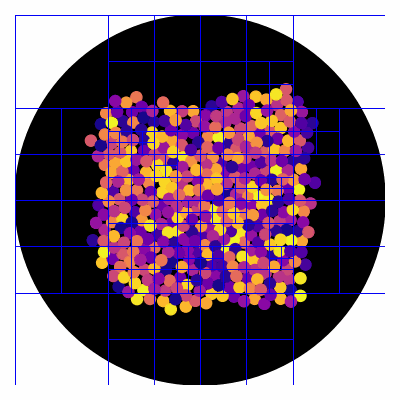
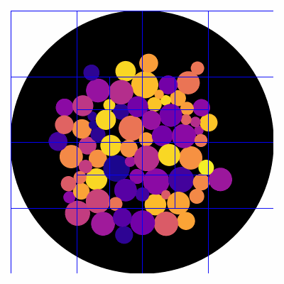
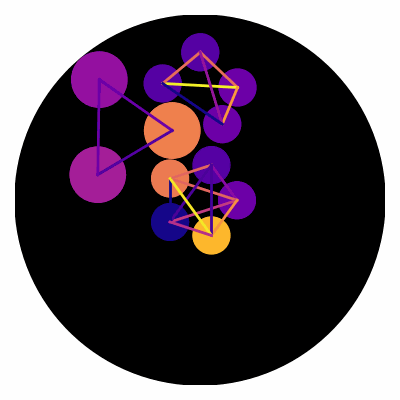
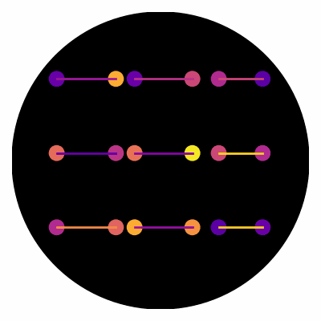

# 2D Physics Simulator

## Overview
This is a simple toy project designed for fun experimentation with simulating 2D physics. This project utilizes quadtrees for efficient collision detection and supports springs and dampers to simulate simple mass-spring-damper systems.

## Key Features
A few examples are provided in ```examples.ipynb``` highlighting the key features of the project.

### Collision detection with Quadtrees
 <table>
  <tr>
    <td> </td>
    <td></td>
  </tr>
</table> 

### Simulating mass-spring-damper systems
 <table>
  <tr>
    <td> </td>
    <td></td>
  </tr>
</table> 

### Physics based collisions
 <table>
  <tr>
    <td> </td>
    <td></td>
  </tr>
</table> 

